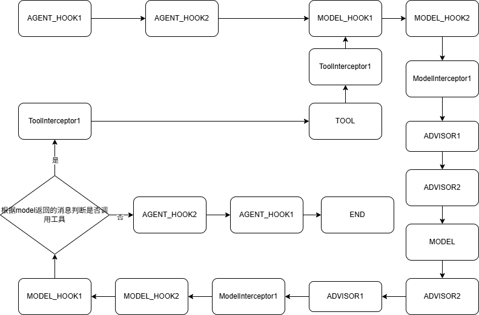
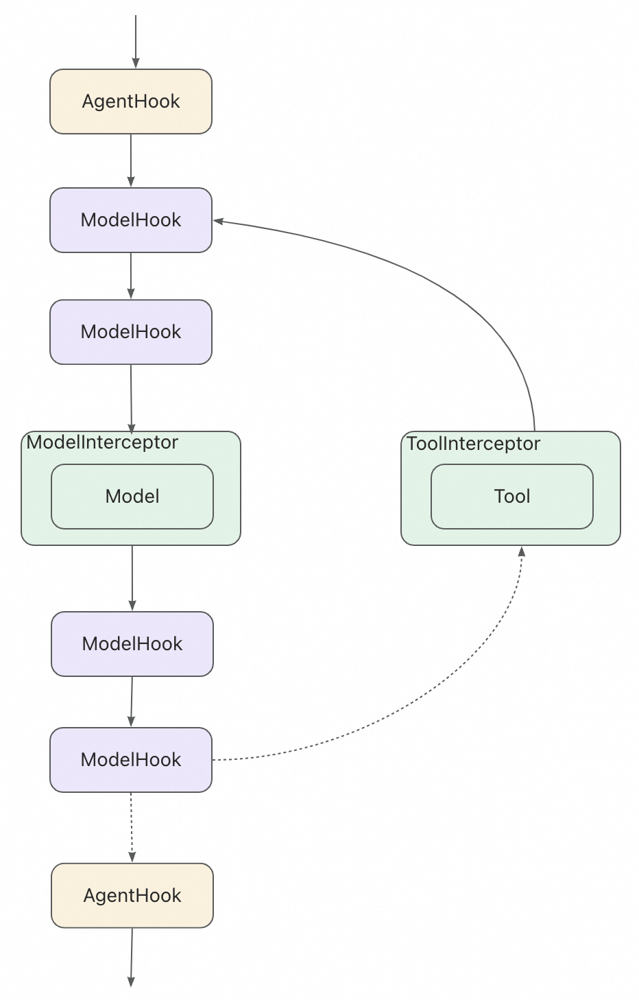

ReactAgent原理：

Spring AI Alibaba 中的`ReactAgent` 基于 Graph 运行时构建。Graph 由节点（steps）和边（connections）组成，定义了 Agent 如何处理信息。Agent 在这个 Graph 中移动，执行如下节点：

*   Model Node (模型节点)：调用 LLM 进行推理和决策
*   Tool Node (工具节点)：执行工具调用
*   Hook Nodes (钩子节点)：在关键位置插入自定义逻辑

这里的节点（steps）可以理解成activiti审批流里的action，节点实例，真正干活的实例

边（connections）可以理解成activiti审批流里的连线，表示从谁到谁，source -> target

ReactAgent请求流程可以描述成下面这样：

框内的id相同的表示同一个对象

从图中可以看到 AGENT_HOOK 全程只会调用一次，而 MODEL_HOOK 可能会调用多次，直到模型认为推理结果满意为止

用官方的图表示如下：

*   总览图

    

*   勾子和拦截器的调用

    

