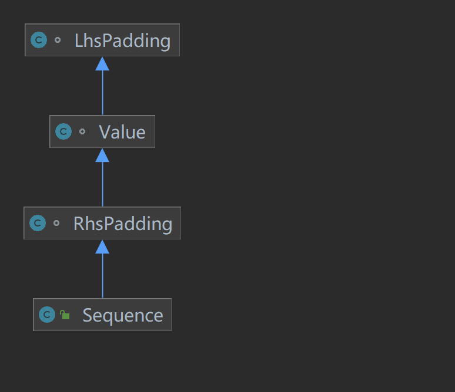

使用一个2的N次幂大小的环数组存储数据，多线程通过cas更新一个写入指针(这个指针一直递增)，比如A线程获取2个槽位，此时指针在 0，那么更新成功之后，这个指针变为2，线程B获取一个槽，那么cas成功之后变成了3
A线程获取成功，那么 0-1的位置可以直接写入数据，B获取到索引下标为2的槽，那么它可以安全写入2这个位置，下面这段代码是获取槽位的逻辑
// n 指的是您要获取的槽数，比如我要连续写入2个数据，那么这个n就指定为2

```java
public long next(int n)
{
if (n < 1)
{
throw new IllegalArgumentException("n must be > 0");
}
// 当前的索引下标
long current;
// 下一个索引下标
long next;

    do
    {
        // cursor 是用来记录当前队列的已经使用的下标，这个下标是一只递增的
        current = cursor.get();
        next = current + n;
        // 用于比较是否已经写完了一圈的数据，写完了一圈的数据之后，后续写入
        // 的数据就要从环形数组的下标 0 开始写入，当 wrapPoint 小于0的时候，不用想，肯定还没写完一圈
        long wrapPoint = next - bufferSize;
        // 用来记录最低消费进度
        long cachedGatingSequence = gatingSequenceCache.get();
        // 检查写入进度是否超过了消费进度
        // cachedGatingSequence > current 在多线程的情况下，可能会出现，比如当前
        // 线程调用 cursor.get() 之后一直没有获取到CPU时间片，其他线程写入了数据，
        // cachedGatingSequence 被更新，此时就会出现 cachedGatingSequence > current 
        // 的情况，此时就没必要去 cas cursor指针了
        if (wrapPoint > cachedGatingSequence || cachedGatingSequence > current)
        {
            // 获取最低的消费进度（低水位），gatingSequences是指我们消费handler的消费指针数组
            long gatingSequence = Util.getMinimumSequence(gatingSequences, current);
            // 写入进度超过消费进度，避免覆盖掉未消费的数据，此时挂起一段时间
            if (wrapPoint > gatingSequence)
            {
                LockSupport.parkNanos(1); // TODO, should we spin based on the wait strategy?
                continue;
            }
            // 更新消费进度
            gatingSequenceCache.set(gatingSequence);
        }
        // CAS 修改写入指针
        else if (cursor.compareAndSet(current, next))
        {
            break;
        }
    }
    while (true);

    return next;
}
```

在CAS成功之后，那么对应的线程就可以写入对应占用的插槽。另外，写入指针是一直递增的，获取对应数组的下标的方法是通过对写入指针求余，由于数组大小是2的N次幂，所以可通过与运算提高性能。

下面我们再看看如何消费里面的数据

```java


// 创建Disruptor
Disruptor<Event> disruptor = new Disruptor<>(new EventFactory(), 8, Executors.defaultThreadFactory());

// 连接事件处理器
disruptor.handleEventsWith(new EventProcessor());
```

EventProcessor 就是我们自定义的一个消费数据的处理器，对应的类定义如下：
```java

class EventProcessor implements EventHandler<Event> {
    @Override
    public void onEvent(Event event, long sequence, boolean endOfBatch) {
        System.out.println("Consumed: " + event.getMessage());
    }
}
```
这个类重写了 EventHandler 的 onEvent 方法，它有三个参数，分别是用户定义的数据，当前消费的进度，是否已消费到最后一条数据。
了解消费处理器之后，我们再来看看，这个处理器是怎么工作的，在使其发挥作用前，我们先要将这个处理器
注册给Disruptor，代码如下：

```java

disruptor.handleEventsWith(new EventProcessor());
以下是注册的核心代码
// barrierSequences：这个参数表示依赖的消费进度，如果是直接通过disruptor.handleEventsWith
// 注册的处理器，这个依赖是空数组，如果通过 disruptor.handleEventsWith 的返回值，也就是当前这个
// 方法返回的 EventHandlerGroup 去注册的处理器，那么 barrierSequences 就是等于依赖通过
// disruptor.handleEventsWith 注册的那些处理器的消费进度
EventHandlerGroup<T> createEventProcessors(
final Sequence[] barrierSequences,
final EventHandler<? super T>[] eventHandlers)
{
checkNotStarted();
// 对应注册消费处理器的消费进度数组
final Sequence[] processorSequences = new Sequence[eventHandlers.length];
// 创建拦截珊栏，用于检查消费进度是否超过写入指针，超过就需要拦截阻塞等待
// barrierSequences 为空数组的时候，消费进度依赖的是环数组的写入指针
final SequenceBarrier barrier = ringBuffer.newBarrier(barrierSequences);

    for (int i = 0, eventHandlersLength = eventHandlers.length; i < eventHandlersLength; i++)
    {
        final EventHandler<? super T> eventHandler = eventHandlers[i];
        // 这是一个实现了Runnable的类，封装需要的数据，实际触发执行消费的处理器
        final BatchEventProcessor<T> batchEventProcessor =
            new BatchEventProcessor<T>(ringBuffer, barrier, eventHandler);

        if (exceptionHandler != null)
        {
            batchEventProcessor.setExceptionHandler(exceptionHandler);
        }
        // 记录每个消费处理器，用于后续封装消费组返回
        consumerRepository.add(batchEventProcessor, eventHandler, barrier);
        // 获取对应消费处理器的消费进度列表，用于后续封装消费组返回
        processorSequences[i] = batchEventProcessor.getSequence();
    }

    if (processorSequences.length > 0)
    {
        consumerRepository.unMarkEventProcessorsAsEndOfChain(barrierSequences);
    }
    // 归类成一组消费处理组
    return new EventHandlerGroup<T>(this, consumerRepository, processorSequences);
}

```
可以看到以上方法主要做了两件事情：
第一件事情就是创建实际执行任务的处理器 BatchEventProcessor，这个处理器组合了2个能力，一个是barrier，用于拦截消费进度不能超过写入指针，另一个是 eventHandler，这是用于定义的具体如何消费数据的行为，最后就是它自身的能力，就是从 ringBuffer 中获取数据去消费

第二件事情就是将这一批注册的消费处理器归类为一个消费组，后续通过这个消费组注册的消费处理器，它的消费进度都要依赖这个组里的消费进度

我们现在主要关心 BatchEventProcessor 是如何消费的，下面是它的处理逻辑：

```java

@Override
public void run()
{
// 控制并发，只能执行一次
if (!running.compareAndSet(false, true))
{
throw new IllegalStateException("Thread is already running");
}
sequenceBarrier.clearAlert();

    notifyStart();

    T event = null;
    // 获取当前处理器的下次需要消费的指针
    long nextSequence = sequence.get() + 1L;
    try
    {
        while (true)
        {
            try
            {
                // 通过珊栏获取有效的最大的消费指针，如果 nextSequence 超过了写入指针或者其
                // 依赖的消费指针，那么将会被阻塞
                final long availableSequence = sequenceBarrier.waitFor(nextSequence);

                while (nextSequence <= availableSequence)
                {
                    // 获取数据消费
                    event = dataProvider.get(nextSequence);
                    eventHandler.onEvent(event, nextSequence, nextSequence == availableSequence);
                    nextSequence++;
                }
                // 更新当前消费进度
                sequence.set(availableSequence);
            }
            catch (final TimeoutException e)
            {
                notifyTimeout(sequence.get());
            }
            catch (final AlertException ex)
            {
                if (!running.get())
                {
                    break;
                }
            }
            catch (final Throwable ex)
            {
                exceptionHandler.handleEventException(ex, nextSequence, event);
                sequence.set(nextSequence);
                nextSequence++;
            }
        }
    }
    finally
    {
        notifyShutdown();
        running.set(false);
    }
}

```
上面这段逻辑很清晰，第一步拿着自己想要消费的指针去问我是否可以获取该位置的数据，如果说消费的进度已经超过了写入进度，那么就阻塞等待，直到被通知可以消费。

以上就是 Disruptor 的写入与消费的逻辑了，下面我们来看看 Disruptor 到底比我们平常用的并发队列好在哪？

- 解决伪共享的问题

在Disruptor主要会发生频繁修改的是消费进度，为了避免导致的伪共享问题，Disruptor的sequence做了缓存行填充




```java

class LhsPadding
{
protected long p1, p2, p3, p4, p5, p6, p7;
}

class Value extends LhsPadding
{
protected volatile long value;
}

class RhsPadding extends Value
{
protected long p9, p10, p11, p12, p13, p14, p15;
}

```
sequence 继承了以上几个类，一般我们的CPU缓存后是64字节的，所以理论上只要填充8个long类型的数据就可以把一个缓存行填满。但是从上面的继承的类上会发现除了value之外实际填充了14个long，而不是7个，只是什么意思？其实 Disruptor 这么做主要是为了解决读取的数据被任意截断的问题，一个缓存行64个字节，并不能保证它就是从P1开始读取8个连续的值，也可能从 p6开始读取数据到缓存行，此时的缓存行变成（x代表其他无关的变量）
```java
p6，p7，value，x，x，x，x，x
```
如果出现这种情况下话，如果那些无关变量发生了变化，会导致整个缓存行失效，为了避免这种问题，那么就需要再设置一些连续的值，那就是 p9~p15，这样的话，只要该数据行包含这个value，无论你从p1~value中的任意一个值开始读入数据到缓存行，都是能有效避免其他无关变量占用缓存行。比如我从value开始读取8个字节
```java
value,p9，p10，p11，p12，p13，p14，p15
```
- CAS
通过CAS无锁化写入数据
- 环形数组
不会发生扩容，不会移动数据，不会主动删除数据，循环写入覆盖久的数据，数组的连续内存对缓存非常友好
